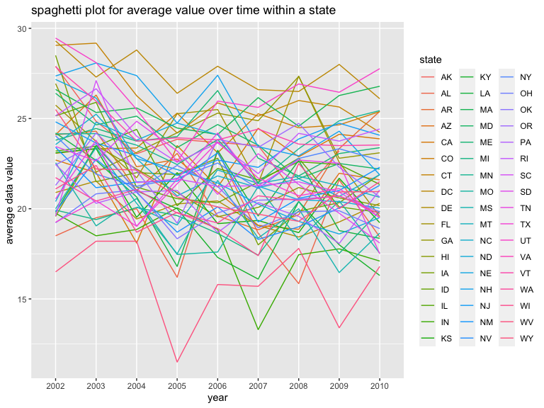

p8105\_hw3\_yz4182
================
Yujin Zhang
10/17/2021

``` r
library(tidyverse)
```

    ## ── Attaching packages ─────────────────────────────────────── tidyverse 1.3.1 ──

    ## ✓ ggplot2 3.3.5     ✓ purrr   0.3.4
    ## ✓ tibble  3.1.4     ✓ dplyr   1.0.7
    ## ✓ tidyr   1.1.3     ✓ stringr 1.4.0
    ## ✓ readr   2.0.1     ✓ forcats 0.5.1

    ## ── Conflicts ────────────────────────────────────────── tidyverse_conflicts() ──
    ## x dplyr::filter() masks stats::filter()
    ## x dplyr::lag()    masks stats::lag()

``` r
library(httr)
library(jsonlite)
```

    ## 
    ## Attaching package: 'jsonlite'

    ## The following object is masked from 'package:purrr':
    ## 
    ##     flatten

## Data Science Homework 3

Problem 1

The goal is to do some exploration of this dataset. To that end, write a
short description of the dataset, noting the size and structure of the
data, describing some key variables, and giving illstrative examples of
observations.

1.  How many aisles are there, and which aisles are the most items
    ordered from?

``` r
# load the dataset
library(p8105.datasets)
data("instacart")

# count the number of aisles
count_aisle = 
  instacart %>% 
  group_by(aisle) %>%
  count(name = "n_obs") %>% 
  arrange(n_obs)
```

For this question, the amount of aisles is 134, and fresh vegetables are
the most items ordered from.

2.  Make a plot that shows the number of items ordered in each aisle,
    limiting this to aisles with more than 10000 items ordered.

``` r
# filter the aisle whose count > 10000
count_filter = 
  instacart %>% 
  group_by(aisle_id, aisle) %>% 
  count(name = "n_obs") %>% 
  filter(n_obs > 10000) %>% 
  arrange(desc(n_obs))

# make a plot to show the number of items ordered in each aisle  
ggplot(count_filter, aes(x = reorder(aisle, n_obs), y = n_obs)) +
  geom_bar(stat = "identity") +
  labs(title = "bar diagram for number of items ordered in each aisle", x = "name of aisles", y = "count")
```

<!-- -->

3.  Make a table showing the three most popular items in each of the
    aisles “baking ingredients”, “dog food care”, and “packaged
    vegetables fruits”. Include the number of times each item is ordered
    in your table.

``` r
# make a table showing the three most popular
join_most3popular =
  instacart %>% 
  filter(aisle %in% c("baking ingredients", "dog food care", "packaged vegetables fruits" )) %>% 
  group_by(aisle, product_name) %>% 
  count(name = "counts") %>% 
  group_by(aisle) %>% 
  mutate(rank =  order(order(counts, decreasing = TRUE))) %>% # add a variable which shows rank of each product
  filter(rank < 4) %>% 
  arrange(aisle, rank) %>% 
  knitr::kable()
```

4.  Make a table showing the mean hour of the day at which Pink Lady
    Apples and Coffee Ice Cream are ordered on each day of the week

``` r
# select variables and observations in Pink Lady Apples and Coffee Ice Cream
order_hour = 
  instacart %>% 
  filter(product_name %in% c("Pink Lady Apples", "Coffee Ice Cream")) %>% 
  select(product_name, order_dow, order_hour_of_day) %>%
  arrange(product_name, order_dow) %>% 
  group_by(product_name, order_dow) %>% 
  summarize(mean_hour = mean(order_hour_of_day)) %>% 
  mutate(order_dow = recode(order_dow, "0" = "Sunday",
                            "1" = "Monday",
                            "2" = "Tuesday",
                            "3" = "Wednesday",
                            "4" = "Thursday",
                            "5" = "Friday",
                            "6" = "Saturday")) %>% 
  pivot_wider(
    names_from = "order_dow",
    values_from = "mean_hour"
  ) %>% # format a readable table 
  knitr::kable()
```

    ## `summarise()` has grouped output by 'product_name'. You can override using the `.groups` argument.

## Problem 2

Load the dataset

``` r
var_names = 
  GET("https://chronicdata.cdc.gov/views/acme-vg9e.json") %>%
  content("text") %>%
  fromJSON() %>% 
  .[["columns"]] %>% 
  .[["name"]] %>% 
  .[1:22]

brfss_smart2010 = 
  GET("https://chronicdata.cdc.gov/views/acme-vg9e/rows.json") %>% 
  content("text") %>%
  fromJSON() %>% 
  .[["data"]]

row_as_tibble = function(row_as_list, var_names) {
  var_list = row_as_list[9:30]
  names(var_list) = var_names 
  var_list[sapply(var_list, is.null)] <- NULL
  as_tibble(var_list, validate = FALSE)
}

brfss_smart2010 = 
  brfss_smart2010 %>% 
  map(.x = ., ~row_as_tibble(.x, var_names)) %>% 
  bind_rows
```

1.  do data cleaning:

Format the data to use appropriate variable names; focus on the “Overall
Health” topic; include only responses from “Excellent” to “Poor”;
organize responses as a factor taking levels ordered from “Poor” to
“Excellent”;

``` r
data_brfss_smart2010 =
  brfss_smart2010 %>% 
  janitor::clean_names() %>% 
  rename("location_abbr" = locationabbr, "location_desc" = locationdesc, "resp_id" = respid) %>% 
  separate(location_desc, into = c("state", "location"), sep = " - ") %>% 
  filter(topic == "Overall Health") %>% 
  filter(response %in% c("Excellent", "Poor", "Very good", "Good", "Fair")) %>% 
  mutate(response = factor(response, levels = c("Poor", "Fair", "Good", "Very good", "Excellent"))) %>% 
  mutate(data_value = as.numeric(data_value)) %>% 
  arrange(year) %>% 
  select(-location_abbr)
```

2.  Answer the question: In 2002, which states were observed at 7 or
    more locations? What about in 2010?

``` r
more_than_7locations =
  data_brfss_smart2010 %>% 
  group_by(year, state) %>%
  count(name = "count") %>% 
  filter(year %in% c("2002", "2010") & count >= 7) %>% 
  knitr::kable()
```

In 2002, FL, MA, MD, NJ, NY, PA were observed at 7 or more locations.

In 2010, CA, FL, MA, MD, ME, MI, NC, NE, NJ, PA, TX, UT, WA were
observed at 7 or more locations.

3.  Construct a dataset that is limited to Excellent responses, and
    contains, year, state, and a variable that averages the data\_value
    across locations within a state. Make a “spaghetti” plot of this
    average value over time within a state

``` r
# filter the excellent rows and calculate the mean
excellent_responses =
  data_brfss_smart2010 %>% 
  filter(response == "Excellent") %>%
  select(year, state, response, data_value) %>%
  mutate(data_value = as.numeric(data_value)) %>% 
  group_by(state, year) %>% 
  summarise(mean(data_value, na.rm = TRUE)) %>% 
  rename("averages_data_value" = "mean(data_value, na.rm = TRUE)") %>% 
  arrange(year)
```

    ## `summarise()` has grouped output by 'state'. You can override using the `.groups` argument.

``` r
# make the plot
excellent_responses %>% 
  ggplot(aes(x = year, y = averages_data_value, group = state)) +
  geom_line(aes(color = state)) +
  labs(title = "spaghetti plot for average value over time within a state", 
       x = "year", 
       y = "average data value")
```

<!-- -->

4.  Make a two-panel plot showing, for the years 2006, and 2010,
    distribution of data\_value for responses (“Poor” to “Excellent”)
    among locations in NY State.

``` r
NY_state_df = 
  data_brfss_smart2010 %>% 
  filter(state == "NY" & year %in% c(2006, 2010))

# make the density plot
NY_state_df %>% 
  group_by(response) %>% 
  ggplot(aes(x = data_value, fill = response)) +
  geom_density(alpha = .5, adjust = .5) +
  labs(
    title = "Two-Panel Plot for Responses in NY State in 2006 and 2010",
    x = "Data Value",
    y = "Density") +
  facet_grid(year ~ response)
```

<!-- -->

## Problem 3

1.  Load, tidy, and otherwise wrangle the data. Your final dataset
    should include all originally observed variables and values; have
    useful variable names; include a weekday vs weekend variable; and
    encode data with reasonable variable classes. Describe the resulting
    dataset (e.g. what variables exist, how many observations, etc).

``` r
accel_df = 
  read_csv("./data/accel_data.csv") %>% 
  janitor::clean_names() %>% 
  mutate(weekday_vs_weekend = day) %>% 
  mutate(weekday_vs_weekend = recode(weekday_vs_weekend,
    "Friday" = "Weekday",
    "Monday" = "Weekday",
    "Thursday" = "Weekday",
    "Tuesday" = "Weekday",
    "Wednesday" = "Weekday",
    "Saturday" = "Weekend",
    "Sunday" = "Weekend")) %>% 
  mutate( day = factor(day, 
    levels = c("Sunday", "Monday", "Tuesday", "Wednesday", "Thursday", "Friday", "Saturday"))) %>% 
  relocate(weekday_vs_weekend) %>% 
  pivot_longer(
    activity_1:activity_1440,
    names_prefix = "activity_",
    names_to = "minutes_order",
    values_to = "activity_counts"
  ) %>% 
  mutate(minutes_order = as.numeric(minutes_order)) %>% 
  relocate(week, day_id)
```

2.Traditional analyses of accelerometer data focus on the total activity
over the day. Using your tidied dataset, aggregate across minutes to
create a total activity variable for each day, and create a table
showing these totals. Are any trends apparent?

``` r
total = 
  accel_df %>% 
  group_by(day_id) %>% 
  mutate(total_count = sum(activity_counts)) %>% 
  select(-activity_counts, -minutes_order) %>% 
  distinct() %>% 
  arrange(week, day)  
  
knitr::kable(total)
```

| week | day\_id | weekday\_vs\_weekend | day       | total\_count |
|-----:|--------:|:---------------------|:----------|-------------:|
|    1 |       4 | Weekend              | Sunday    |    631105.00 |
|    1 |       2 | Weekday              | Monday    |     78828.07 |
|    1 |       6 | Weekday              | Tuesday   |    307094.24 |
|    1 |       7 | Weekday              | Wednesday |    340115.01 |
|    1 |       5 | Weekday              | Thursday  |    355923.64 |
|    1 |       1 | Weekday              | Friday    |    480542.62 |
|    1 |       3 | Weekend              | Saturday  |    376254.00 |
|    2 |      11 | Weekend              | Sunday    |    422018.00 |
|    2 |       9 | Weekday              | Monday    |    295431.00 |
|    2 |      13 | Weekday              | Tuesday   |    423245.00 |
|    2 |      14 | Weekday              | Wednesday |    440962.00 |
|    2 |      12 | Weekday              | Thursday  |    474048.00 |
|    2 |       8 | Weekday              | Friday    |    568839.00 |
|    2 |      10 | Weekend              | Saturday  |    607175.00 |
|    3 |      18 | Weekend              | Sunday    |    467052.00 |
|    3 |      16 | Weekday              | Monday    |    685910.00 |
|    3 |      20 | Weekday              | Tuesday   |    381507.00 |
|    3 |      21 | Weekday              | Wednesday |    468869.00 |
|    3 |      19 | Weekday              | Thursday  |    371230.00 |
|    3 |      15 | Weekday              | Friday    |    467420.00 |
|    3 |      17 | Weekend              | Saturday  |    382928.00 |
|    4 |      25 | Weekend              | Sunday    |    260617.00 |
|    4 |      23 | Weekday              | Monday    |    409450.00 |
|    4 |      27 | Weekday              | Tuesday   |    319568.00 |
|    4 |      28 | Weekday              | Wednesday |    434460.00 |
|    4 |      26 | Weekday              | Thursday  |    340291.00 |
|    4 |      22 | Weekday              | Friday    |    154049.00 |
|    4 |      24 | Weekend              | Saturday  |      1440.00 |
|    5 |      32 | Weekend              | Sunday    |    138421.00 |
|    5 |      30 | Weekday              | Monday    |    389080.00 |
|    5 |      34 | Weekday              | Tuesday   |    367824.00 |
|    5 |      35 | Weekday              | Wednesday |    445366.00 |
|    5 |      33 | Weekday              | Thursday  |    549658.00 |
|    5 |      29 | Weekday              | Friday    |    620860.00 |
|    5 |      31 | Weekend              | Saturday  |      1440.00 |

``` r
# to get the trends from the dataset
total %>% 
  ggplot(aes(x = day, y = total_count, group = week)) +
  geom_line(aes(color = week)) +
  labs(title = "plot for total activity counts in a week", 
       x = "day",
       y = "total count")
```

<!-- -->
Trends:

3.  Accelerometer data allows the inspection activity over the course of
    the day. Make a single-panel plot that shows the 24-hour activity
    time courses for each day and use color to indicate day of the week.
    Describe in words any patterns or conclusions you can make based on
    this graph.

``` r
# mutate the variable to better fit in 24-hour range
accel_df %>% 
  mutate(hours_order = minutes_order/60) %>% 
  arrange(day_id) %>% 
# make a plot to show 24-hour activity time courses for each day
  ggplot(aes(x = hours_order, y = activity_counts, group = day_id)) +
  geom_line(aes(color = day_id)) +
  labs(title = "plot for 24-hour activity time courses for each day", 
       x = "24-hour of the day",
       y = "activity count") +
  scale_x_continuous(
    breaks = c(0, 4, 8, 12, 16, 20, 24),
    labels = c("0", "4", "8", "12", "16", "20", "24"))
```

<!-- -->

Conclusion: the plot above shows that this man tended to have more
activity counts around 12:00 and between 20:00 and 22:00 in a day.
Activity counts were in low status in the evening between 24:00 and 4:00
in a day.
