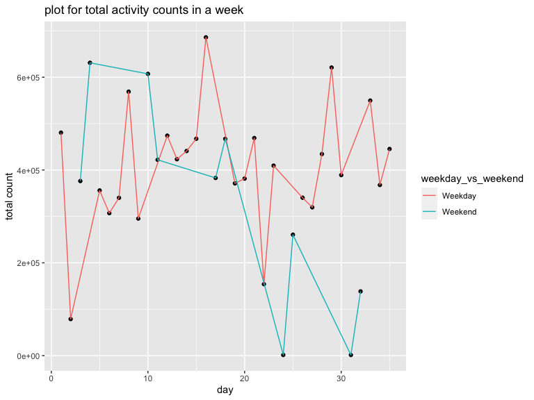

Data Science Homework 3
================
Yujin Zhang
10/17/2021

``` r
library(tidyverse)
```

    ## ── Attaching packages ─────────────────────────────────────── tidyverse 1.3.1 ──

    ## ✓ ggplot2 3.3.5     ✓ purrr   0.3.4
    ## ✓ tibble  3.1.4     ✓ dplyr   1.0.7
    ## ✓ tidyr   1.1.3     ✓ stringr 1.4.0
    ## ✓ readr   2.0.1     ✓ forcats 0.5.1

    ## ── Conflicts ────────────────────────────────────────── tidyverse_conflicts() ──
    ## x dplyr::filter() masks stats::filter()
    ## x dplyr::lag()    masks stats::lag()

``` r
library(httr)
library(jsonlite)
```

    ## 
    ## Attaching package: 'jsonlite'

    ## The following object is masked from 'package:purrr':
    ## 
    ##     flatten

``` r
knitr::opts_chunk$set(
  warning = FALSE,
  fig.width = 8,
  fig.height = 6, 
  out.width = "90%"
)
```

## This is a R Markdown document for Data Science Homework 3.

Problem 1

The goal is to do some exploration of this dataset. To that end, write a
short description of the dataset, noting the size and structure of the
data, describing some key variables, and giving illstrative examples of
observations.

``` r
# load the dataset
library(p8105.datasets)
data("instacart")

head(instacart, 4)
```

    ## # A tibble: 4 × 15
    ##   order_id product_id add_to_cart_order reordered user_id eval_set order_number
    ##      <int>      <int>             <int>     <int>   <int> <chr>           <int>
    ## 1        1      49302                 1         1  112108 train               4
    ## 2        1      11109                 2         1  112108 train               4
    ## 3        1      10246                 3         0  112108 train               4
    ## 4        1      49683                 4         0  112108 train               4
    ## # … with 8 more variables: order_dow <int>, order_hour_of_day <int>,
    ## #   days_since_prior_order <int>, product_name <chr>, aisle_id <int>,
    ## #   department_id <int>, aisle <chr>, department <chr>

Description:

The dataset includes 15 variables and 1384617 observations. The above
table shows the example rows of this dataset, where each row in the
dataset is a product from an order. The meaning of every variable is:

order\_id: order identifier

product\_id: product identifier

add\_to\_cart\_order: order in which each product was added to cart

reordered: 1 if this prodcut has been ordered by this user in the past,
0 otherwise

user\_id: customer identifier

eval\_set: which evaluation set this order belongs in (Note that the
data for use in this class is exclusively from the “train” eval\_set)

order\_number: the order sequence number for this user (1=first, n=nth)

order\_dow: the day of the week on which the order was placed

order\_hour\_of\_day: the hour of the day on which the order was placed

days\_since\_prior\_order: days since the last order, capped at 30, NA
if order\_number=1

product\_name: name of the product

aisle\_id: aisle identifier

department\_id: department identifier

aisle: the name of the aisle

department: the name of the department

1.  How many aisles are there, and which aisles are the most items
    ordered from?

``` r
# count the number of aisles
count_aisle = 
  instacart %>% 
  group_by(aisle) %>%
  count(name = "n_obs") %>% 
  arrange(desc(n_obs))
  
head(count_aisle, 2)
```

    ## # A tibble: 2 × 2
    ## # Groups:   aisle [2]
    ##   aisle             n_obs
    ##   <chr>             <int>
    ## 1 fresh vegetables 150609
    ## 2 fresh fruits     150473

For this question, the amount of aisles was 134, and “fresh vegetables”
was the most items ordered from.

2.  Make a plot that shows the number of items ordered in each aisle,
    limiting this to aisles with more than 10000 items ordered.

``` r
# filter the aisle whose count > 10000
count_filter = 
  instacart %>% 
  group_by(aisle_id, aisle) %>% 
  count(name = "n_obs") %>% 
  filter(n_obs > 10000) %>% 
  arrange(desc(n_obs))

# make a plot to show the number of items ordered in each aisle  
ggplot(count_filter, aes(x = reorder(aisle, n_obs), y = n_obs)) +
  geom_bar(aes(fill = aisle), stat = "identity") +
  labs(title = "bar diagram for number of items ordered in each aisle", x = "name of aisles", y = "count") +
  scale_x_discrete(labels = NULL)
```


The bar diagram above showed the number of items ordered in aisles,
which had more than 10000 items ordered.

3.  Make a table showing the three most popular items in each of the
    aisles “baking ingredients”, “dog food care”, and “packaged
    vegetables fruits”. Include the number of times each item is ordered
    in your table.

``` r
# make a table showing the three most popular
join_most3popular =
  instacart %>% 
  filter(aisle %in% c("baking ingredients", "dog food care", "packaged vegetables fruits" )) %>% 
  group_by(aisle, product_name) %>% 
  count(name = "counts") %>% 
  group_by(aisle) %>% 
  mutate(rank =  order(order(counts, decreasing = TRUE))) %>% # add a variable which shows rank of each product
  filter(rank < 4) %>% # find the three most popular items
  arrange(aisle)
```

| aisle                      | product\_name                                 | counts | rank |
|:---------------------------|:----------------------------------------------|-------:|-----:|
| baking ingredients         | Cane Sugar                                    |    336 |    3 |
| baking ingredients         | Light Brown Sugar                             |    499 |    1 |
| baking ingredients         | Pure Baking Soda                              |    387 |    2 |
| dog food care              | Organix Chicken & Brown Rice Recipe           |     28 |    2 |
| dog food care              | Small Dog Biscuits                            |     26 |    3 |
| dog food care              | Snack Sticks Chicken & Rice Recipe Dog Treats |     30 |    1 |
| packaged vegetables fruits | Organic Baby Spinach                          |   9784 |    1 |
| packaged vegetables fruits | Organic Blueberries                           |   4966 |    3 |
| packaged vegetables fruits | Organic Raspberries                           |   5546 |    2 |

4.  Make a table showing the mean hour of the day at which Pink Lady
    Apples and Coffee Ice Cream are ordered on each day of the week

``` r
# select variables and observations in Pink Lady Apples and Coffee Ice Cream
order_hour = 
  instacart %>% 
  filter(product_name %in% c("Pink Lady Apples", "Coffee Ice Cream")) %>% 
  select(product_name, order_dow, order_hour_of_day) %>%
  arrange(product_name, order_dow) %>% 
  group_by(product_name, order_dow) %>% 
  summarize(mean_hour = mean(order_hour_of_day)) %>% 
  mutate(order_dow = recode(order_dow, "0" = "Sunday",
                            "1" = "Monday",
                            "2" = "Tuesday",
                            "3" = "Wednesday",
                            "4" = "Thursday",
                            "5" = "Friday",
                            "6" = "Saturday")) %>% 
  pivot_wider(
    names_from = "order_dow",
    values_from = "mean_hour"
  )  # format a readable table 
```

    ## `summarise()` has grouped output by 'product_name'. You can override using the `.groups` argument.

| product\_name    |   Sunday |   Monday |  Tuesday | Wednesday | Thursday |   Friday | Saturday |
|:-----------------|---------:|---------:|---------:|----------:|---------:|---------:|---------:|
| Coffee Ice Cream | 13.77419 | 14.31579 | 15.38095 |  15.31818 | 15.21739 | 12.26316 | 13.83333 |
| Pink Lady Apples | 13.44118 | 11.36000 | 11.70213 |  14.25000 | 11.55172 | 12.78431 | 11.93750 |

## Problem 2

Load the dataset

``` r
var_names = 
  GET("https://chronicdata.cdc.gov/views/acme-vg9e.json") %>%
  content("text") %>%
  fromJSON() %>% 
  .[["columns"]] %>% 
  .[["name"]] %>% 
  .[1:22]

brfss_smart2010 = 
  GET("https://chronicdata.cdc.gov/views/acme-vg9e/rows.json") %>% 
  content("text") %>%
  fromJSON() %>% 
  .[["data"]]

row_as_tibble = function(row_as_list, var_names) {
  var_list = row_as_list[9:30]
  names(var_list) = var_names 
  var_list[sapply(var_list, is.null)] <- NULL
  as_tibble(var_list, validate = FALSE)
}

brfss_smart2010 = 
  brfss_smart2010 %>% 
  map(.x = ., ~row_as_tibble(.x, var_names)) %>% 
  bind_rows
```

1.  do data cleaning:

Format the data to use appropriate variable names; focus on the “Overall
Health” topic; include only responses from “Excellent” to “Poor”;
organize responses as a factor taking levels ordered from “Poor” to
“Excellent”;

``` r
data_brfss_smart2010 =
  brfss_smart2010 %>% 
  janitor::clean_names() %>% 
  rename("location_abbr" = locationabbr, "location_desc" = locationdesc, "resp_id" = respid) %>% 
  separate(location_desc, into = c("state", "location"), sep = " - ") %>% 
  filter(topic == "Overall Health") %>% 
  filter(response %in% c("Excellent", "Poor", "Very good", "Good", "Fair")) %>% 
  mutate(response = factor(response, levels = c("Poor", "Fair", "Good", "Very good", "Excellent"))) %>% 
  mutate(data_value = as.numeric(data_value)) %>% 
  arrange(year) %>% 
  select(-location_abbr)

# show the data frame
data_brfss_smart2010
```

    ## # A tibble: 10,625 × 21
    ##    year  state location  class  topic  question  response sample_size data_value
    ##    <chr> <chr> <chr>     <chr>  <chr>  <chr>     <fct>    <chr>            <dbl>
    ##  1 2002  IN    Marion C… Healt… Overa… How is y… Poor     26                 3.5
    ##  2 2002  GA    Fulton C… Healt… Overa… How is y… Fair     22                 6.8
    ##  3 2002  FL    Hillsbor… Healt… Overa… How is y… Poor     16                 4.2
    ##  4 2002  MI    Oakland … Healt… Overa… How is y… Very go… 173               38.3
    ##  5 2002  MS    Hinds Co… Healt… Overa… How is y… Very go… 89                28.8
    ##  6 2002  SD    Minnehah… Healt… Overa… How is y… Excelle… 193               23.5
    ##  7 2002  OH    Montgome… Healt… Overa… How is y… Excelle… 94                18.8
    ##  8 2002  TN    Shelby C… Healt… Overa… How is y… Excelle… 102               18.7
    ##  9 2002  DE    Sussex C… Healt… Overa… How is y… Fair     167               11  
    ## 10 2002  MD    Montgome… Healt… Overa… How is y… Very go… 221               34.7
    ## # … with 10,615 more rows, and 12 more variables: confidence_limit_low <chr>,
    ## #   confidence_limit_high <chr>, display_order <chr>, data_value_unit <chr>,
    ## #   data_value_type <chr>, data_source <chr>, class_id <chr>, topic_id <chr>,
    ## #   question_id <chr>, resp_id <chr>, data_value_footnote_symbol <chr>,
    ## #   data_value_footnote <chr>

2.  Answer the question: In 2002, which states were observed at 7 or
    more locations? What about in 2010?

``` r
more_than_7locations =
  data_brfss_smart2010 %>% 
  group_by(year, state) %>%
  distinct(location) %>% 
  count(name = "count") %>% 
  filter(year %in% c("2002", "2010") & count >= 7)
```

| year | state | count |
|:-----|:------|------:|
| 2002 | CT    |     7 |
| 2002 | FL    |     7 |
| 2002 | MA    |     8 |
| 2002 | NC    |     7 |
| 2002 | NJ    |     8 |
| 2002 | PA    |    10 |
| 2010 | CA    |    12 |
| 2010 | CO    |     7 |
| 2010 | FL    |    41 |
| 2010 | MA    |     9 |
| 2010 | MD    |    12 |
| 2010 | NC    |    12 |
| 2010 | NE    |    10 |
| 2010 | NJ    |    19 |
| 2010 | NY    |     9 |
| 2010 | OH    |     8 |
| 2010 | PA    |     7 |
| 2010 | SC    |     7 |
| 2010 | TX    |    16 |
| 2010 | WA    |    10 |

In 2002, CT, FL, MA, NJ, NC, PA were observed at 7 or more locations.

In 2010, CA, CO, FL, MA, MD, NC, NE, NJ, NY, OH, PA, SC, TX, WA were
observed at 7 or more locations.

3.  Construct a dataset that is limited to Excellent responses, and
    contains, year, state, and a variable that averages the data\_value
    across locations within a state. Make a “spaghetti” plot of this
    average value over time within a state

``` r
# filter the excellent rows and calculate the mean
excellent_responses =
  data_brfss_smart2010 %>% 
  filter(response == "Excellent") %>%
  select(year, state, response, data_value) %>%
  group_by(state, year) %>% 
  summarise(mean(data_value, na.rm = TRUE)) %>% # ignore the missing data when calculating
  rename("averages_data_value" = "mean(data_value, na.rm = TRUE)") %>% 
  arrange(year)


# make the plot
excellent_responses %>% 
  ggplot(aes(x = year, y = averages_data_value, group = state)) +
  geom_line(aes(color = state)) +
  labs(title = "spaghetti plot for average value over time within a state", 
       x = "year", 
       y = "average data value")
```


4.  Make a two-panel plot showing, for the years 2006, and 2010,
    distribution of data\_value for responses (“Poor” to “Excellent”)
    among locations in NY State.

``` r
NY_state_df = 
  data_brfss_smart2010 %>% 
  filter(state == "NY" & year %in% c(2006, 2010))

# make the density plot
NY_state_df %>% 
  group_by(response) %>% 
  ggplot(aes(x = data_value, fill = response)) +
  geom_density(alpha = .5, adjust = .5, color = "blue") +
  labs(
    title = "Two-Panel Plot for Responses in NY State in 2006 and 2010",
    x = "Data Value",
    y = "Density") +
  facet_grid( ~ year)
```


## Problem 3

1.  Load, tidy, and otherwise wrangle the data. Your final dataset
    should include all originally observed variables and values; have
    useful variable names; include a weekday vs weekend variable; and
    encode data with reasonable variable classes. Describe the resulting
    dataset (e.g. what variables exist, how many observations, etc).

``` r
accel_df = 
  read_csv("./data/accel_data.csv") %>% 
  janitor::clean_names() %>% 
  mutate(weekday_vs_weekend = day) %>% 
  mutate(weekday_vs_weekend = recode(weekday_vs_weekend,
    "Friday" = "Weekday",
    "Monday" = "Weekday",
    "Thursday" = "Weekday",
    "Tuesday" = "Weekday",
    "Wednesday" = "Weekday",
    "Saturday" = "Weekend",
    "Sunday" = "Weekend")) %>% 
  mutate( day = factor(day, 
    levels = c("Sunday", "Monday", "Tuesday", "Wednesday", "Thursday", "Friday", "Saturday"))) %>% 
  relocate(weekday_vs_weekend) %>% 
  pivot_longer(
    activity_1:activity_1440,
    names_prefix = "activity_",
    names_to = "minutes_order",
    values_to = "activity_counts"
  ) %>% 
  mutate(minutes_order = as.numeric(minutes_order)) %>% 
  relocate(week, day_id)
```

2.Traditional analyses of accelerometer data focus on the total activity
over the day. Using your tidied dataset, aggregate across minutes to
create a total activity variable for each day, and create a table
showing these totals. Are any trends apparent?

``` r
total = 
  accel_df %>% 
  group_by(day_id) %>% 
  mutate(total_count = sum(activity_counts)) %>% 
  select(-activity_counts, -minutes_order) %>% 
  distinct() %>% 
  arrange(week, day)  
```

| week | day\_id | weekday\_vs\_weekend | day       | total\_count |
|-----:|--------:|:---------------------|:----------|-------------:|
|    1 |       4 | Weekend              | Sunday    |    631105.00 |
|    1 |       2 | Weekday              | Monday    |     78828.07 |
|    1 |       6 | Weekday              | Tuesday   |    307094.24 |
|    1 |       7 | Weekday              | Wednesday |    340115.01 |
|    1 |       5 | Weekday              | Thursday  |    355923.64 |
|    1 |       1 | Weekday              | Friday    |    480542.62 |
|    1 |       3 | Weekend              | Saturday  |    376254.00 |
|    2 |      11 | Weekend              | Sunday    |    422018.00 |
|    2 |       9 | Weekday              | Monday    |    295431.00 |
|    2 |      13 | Weekday              | Tuesday   |    423245.00 |
|    2 |      14 | Weekday              | Wednesday |    440962.00 |
|    2 |      12 | Weekday              | Thursday  |    474048.00 |
|    2 |       8 | Weekday              | Friday    |    568839.00 |
|    2 |      10 | Weekend              | Saturday  |    607175.00 |
|    3 |      18 | Weekend              | Sunday    |    467052.00 |
|    3 |      16 | Weekday              | Monday    |    685910.00 |
|    3 |      20 | Weekday              | Tuesday   |    381507.00 |
|    3 |      21 | Weekday              | Wednesday |    468869.00 |
|    3 |      19 | Weekday              | Thursday  |    371230.00 |
|    3 |      15 | Weekday              | Friday    |    467420.00 |
|    3 |      17 | Weekend              | Saturday  |    382928.00 |
|    4 |      25 | Weekend              | Sunday    |    260617.00 |
|    4 |      23 | Weekday              | Monday    |    409450.00 |
|    4 |      27 | Weekday              | Tuesday   |    319568.00 |
|    4 |      28 | Weekday              | Wednesday |    434460.00 |
|    4 |      26 | Weekday              | Thursday  |    340291.00 |
|    4 |      22 | Weekday              | Friday    |    154049.00 |
|    4 |      24 | Weekend              | Saturday  |      1440.00 |
|    5 |      32 | Weekend              | Sunday    |    138421.00 |
|    5 |      30 | Weekday              | Monday    |    389080.00 |
|    5 |      34 | Weekday              | Tuesday   |    367824.00 |
|    5 |      35 | Weekday              | Wednesday |    445366.00 |
|    5 |      33 | Weekday              | Thursday  |    549658.00 |
|    5 |      29 | Weekday              | Friday    |    620860.00 |
|    5 |      31 | Weekend              | Saturday  |      1440.00 |

``` r
# to get the trends from the dataset
total %>% 
  ggplot(aes(x = day_id, y = total_count, group = weekday_vs_weekend)) +
  geom_point() +
  geom_line(aes(color = weekday_vs_weekend)) +
  labs(title = "plot for total activity counts in a week", 
       x = "day",
       y = "total count")
```



Trends: The total activity counts in every weekend tended to decrease
when time went by.

3.  Accelerometer data allows the inspection activity over the course of
    the day. Make a single-panel plot that shows the 24-hour activity
    time courses for each day and use color to indicate day of the week.
    Describe in words any patterns or conclusions you can make based on
    this graph.

``` r
# mutate the variable to better fit in 24-hour range
accel_df %>% 
  mutate(hours_order = minutes_order/60) %>% 
  arrange(day_id) %>% 
# make a plot to show 24-hour activity time courses for each day
  ggplot(aes(x = hours_order, y = activity_counts, group = day_id)) +
  geom_line(aes(color = day), alpha = .5) +
  labs(title = "plot for 24-hour activity time courses for each day", 
       x = "24-hour of the day",
       y = "activity count") +
  scale_x_continuous(
    breaks = c(0, 4, 8, 12, 16, 20, 24),
    labels = c("0", "4", "8", "12", "16", "20", "24"))
```


Conclusion: the plot above showed that this man tended to have more
activity counts around 12:00PM, between 8:00PM and 10:00PM in a day.
Activity counts were in low status in the evening between 12:00AM and
4:00AM in a day, with a possible reason that he might be sleeping.
